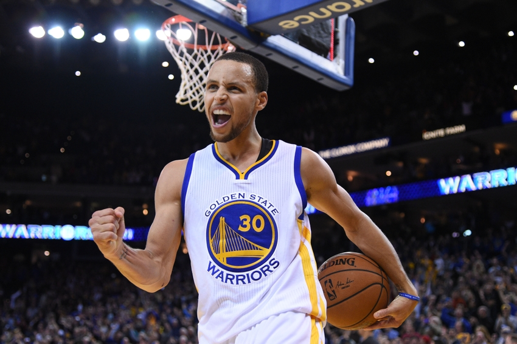
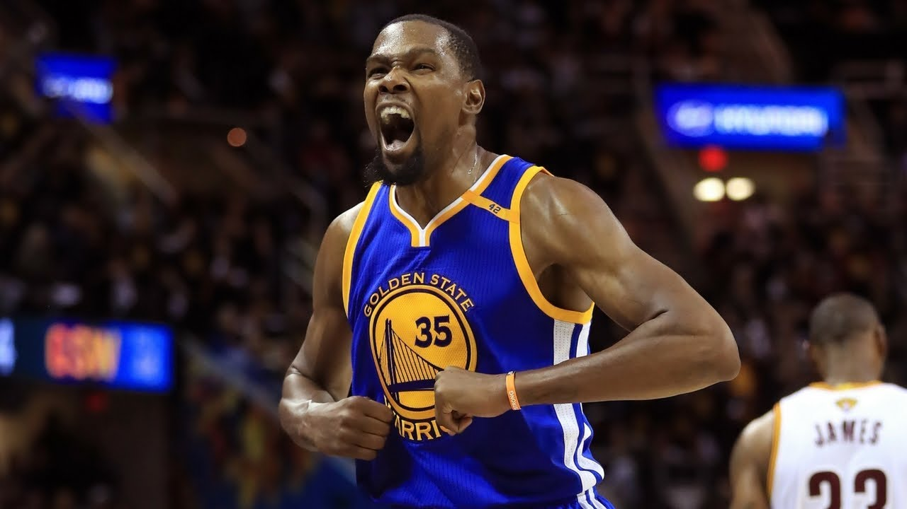

>Introduction: Golden State Warriors has been the best team in NBA since 2015 and has dominated other teams since. Many have argued that ever since Durant has come, Warriors has become the very best shooting team in the league since history. But we always wonder, how's the performance of each  player in Warriors, how their shooting distribution is scattered into different positions, and how well they shoot 2pts, 3pts, total, etc. For this report, we focus on five players from Golden State Warriors, who are showed in the pictures below.

**Stephen Curry**


**Klay Thompson**


**Kevin Durant**


**Draymond Green**


**Andre_Iguodala**


>Motivation: We want to understand each player's contribution to the team and learn about their unqiue strengths. We want to see beyond just the total effective shooting percentages. To do that, we look into the scoring statistic of both the two pointers and three pointers. 

>Background: 
Undoubtly, Golden State Warrior had a very strong performance for 2016 season although regretablely they end up losing the championship to Chevaliers. Each of the player has contributed greatly for their team's achievement. However different players have their different strengths and weekness and thus contribute to the team very differently. For example Stephen Curry is well known for being an excellent three pointer shooter while other players might be more efficient in dunking. That is why we want to take a deaper dive into the statistic and to discover what are the unqiue strength for those players. 

Images: 


>Data


   

  

  

    

  


```{r}
library(dplyr)
dat<-read.csv("../data/shots-data.csv")

#Effective Shooting % by Player

dat %>%
group_by(name) %>%
select(name, shot_made_flag) %>%
summarise(
total = n(),
made = sum(shot_made_flag == 'made shot')
) %>%
mutate(perc_made = 100 * made / total) %>%
arrange(desc(perc_made))

```  
The output is as below:  

  nameof|total|made|perc_made
--------|-----|----|---------
durant  |915  |495 |54.09836
igoudala|371  |192 |51.75202
thompson|1220 |575 |47.13115
curry   |1250 |584 |46.72000
green   |578  |245 |42.38754

```{r}

#2PT Effective Shooting % by Player
dat %>%
filter(shot_type == '2PT Field Goal') %>%
group_by(name) %>%
select(name, shot_made_flag) %>%
summarise(
total = n(),
made = sum(shot_made_flag == 'made shot')
) %>%
mutate(perc_made = 100 * made / total) %>%
arrange(desc(perc_made))
```   
  nameof|total|made|perc_made
--------|-----|----|---------
igoudala|210  |134 |63.80952
durant  |643  |390 |60.65319
curry   |563  |304 |53.99645
thompson|640  |329 |51.40625
green   |346  |171 |49.42197

```{r}
#3PT Effective Shooting % by Player
dat %>%
filter(shot_type == '3PT Field Goal') %>%
group_by(name) %>%
select(name, shot_made_flag) %>%
summarise(
total = n(),
made = sum(shot_made_flag == 'made shot')
) %>%
mutate(perc_made = 100 * made / total) %>%
arrange(desc(perc_made))   
```
  nameof|total|made|perc_made
--------|-----|----|---------
thompson|580  |246 |42.41379
curry   |687  |280 |40.75691
durant  |272  |105 |38.60294
igoudala|161  |58  |36.02484
green   |232  |74  |31.89655


>Shooting Range Analysis: 
Andre Iguodala is best when he's around the rim, and he's an average 3pt shooting player.    
Draymond Green was not very efficient in scoring, regardless of inside the rim or outside the 3pt line.  
Kevin Durant is perfect shooter inside and outside the 3pt line, and he shoots many mid-range shots too.  
Klay thompson makes shots almost as much as he misses, and he's a perfect rim finisher as well as 3pt shooter.  
Stephen Curry seldom makes mid range shots, most of his shots are concentrated outside the 3pt line and inside the rim, and he attempts a few long-distance 3pt shots as well, a perfect 3pt shooter, as with klay.  

>Shooting Percentage Analysis:
In terms of total effective shooting percentage, KD is the best player with many attempts as well, followed by Igoudala, but his shots are mostly open shots and his field goal attempts are considerably less than other players. Thompson and Curry makes the most of the shots and have a very good(47%)percentage as well, whereas Draymond being the worst shooting player regarding total effective percentage.  
In terms of 2PT effective shooting by player, Igoudala surprisingly is the best player, followed by durant, curry, thompson and green. It's also surprising to see that Green as a PF/C also shoots 2pts so badly.  
In terms of 3PT effective shooting by player, Thompson leads with 42.4% percentage, followed by Curry. These two players are amazing with their huge field goal attempts and shooting percentages. Durant makes relatively less field goals with 38.6%, followed then by igoudala and green.  


>Conclusions:Golden State Warriors being the best team in the league, Igoudala and Green mainly contribute to the defensive side of the team, but KD, Curry, Thompson are the best shooters in this team. KD is best in 2pt shooting(mid ranges)as well in total shooting percentage, and Thompson as well as Curry are best when they're shooting 3pts. Any team playing against GSW should pay attention, they are coming at you!

References:
<https://on.nba.com/2Vv1t2u>  
<https://bit.ly/2HcDJMD>  
<https://bit.ly/2BWTmoc>  
<https://bit.ly/2EnDkUD>  


